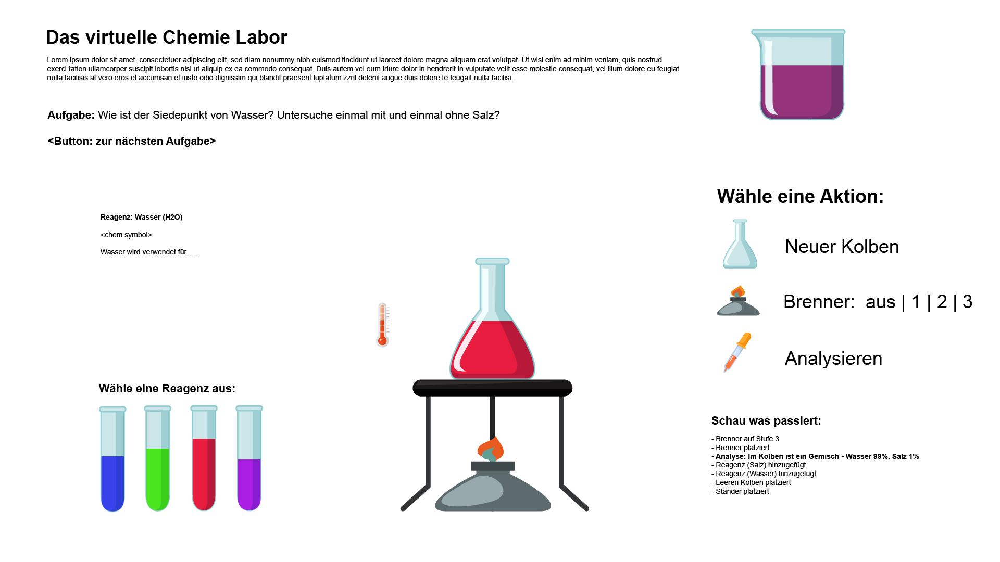

# Das virtuelle Chemielabor

Implementierung eines virtuellen Chemielabors für das Schullabor und virtuelles Berufsschnuppern.

Die Idee basiert auf der Konzeptarbeit von Kandidaten in der Arbeitsprobe, die dort in drei Sprints ein Konzept und erste Entwürfe für das virtuelle Chemielabor entwickeln.

Die Schüler haben über die Webseite die Möglichkeit, kleinere Experimente durchzuführen. Die Oberfläche besteht aus folgenden Bereichen:

(1) Aufgaben

Hier wird das durchzuführende Experiment textuell beschrieben. Wird die Aufgabe gelöst, gelangt man von hier zur nächsten Aufgabe. Die Aufgaben können daher aufeinander aufbauen.

(2) Reagenzien

Es werden unterschiedliche Reagenzien (in Reagenzgläsern) angezeigt. Durch Auswahl einer Reagenz wird eine Information über die Reagenz angezeigt (entsprechend aufbereitet für die Altersgruppe).
Reagenzien sollten erweiterbar sein. 

(3) Experimentierbereich

Hier können die Experimentiergeräte wie Kolben, Brenner, Ständer, usw. an festgelegte Positionen gebracht werden. Der aktuelle Status des Experiements wird über entsprechende visuelle Effekte bzw. Animationen dargestellt.
Ein Thermometer zeigt z.B. die aktuelle Temperatur an. Zusätzlich sollten Status Änderungen über einen "Ticker" angezeigt werden.

(4) Geräte

Minimalausstattung: Kolben, Brenner, Ständer, Thermometer
Sollte erweiterbar sein. 

(5) Aktionen

Über den Aktionen Bereich kann der Schüler bestimmte Dinge im Chemielabor tun:
- Geräte platzieren
- Brenner an/aus und Einstellung verschiedener Hitzestufen
- Analysieren (Pipette). Flüssigkeit analysieren. Es wird angezeigt, was sich gerade im Kolben befindet. 
